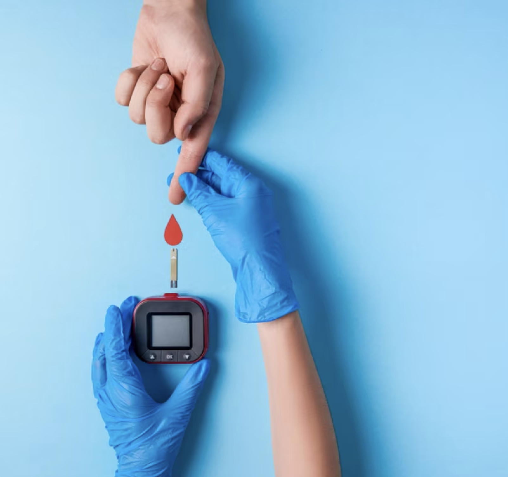

# VitAInsight: Health Risk Prediction Dashboard

VitAInsight is a health risk prediction platform that provides assessments for various health conditions including diabetes, heart disease, breast cancer, and obesity. The platform allows users to input relevant health data and receive an assessment based on machine learning models trained to predict the risk levels for these conditions. It is designed to help users understand their health risks better and take proactive actions.

## Features

VitAInsight offers the following assessments:

### 1. Diabetes Prediction
This feature predicts the likelihood of a user developing diabetes based on inputs like glucose level, blood pressure, insulin, BMI, age, and more. The model is trained using data from the Pima Indians Diabetes dataset, leveraging features indicative of diabetes risks.

### 2. Heart Disease Prediction
The heart disease prediction module assesses a user's risk of developing cardiovascular issues. The model takes inputs such as cholesterol levels, resting blood pressure, heart rate, and more. The dataset used is the Cleveland Heart Disease dataset, and the model helps in identifying individuals at risk of heart disease.

### 3. Breast Cancer Prediction
The breast cancer prediction feature uses inputs like tumor radius, texture, smoothness, compactness, and other metrics to assess the likelihood of malignancy. The model is trained on the Wisconsin Breast Cancer dataset, aiming to differentiate between benign and malignant cases.

### 4. Obesity Assessment
This module provides an obesity assessment by predicting the user's obesity level based on inputs such as gender, age, weight, height, family history, physical activity, and dietary habits. The model gives general health recommendations based on the predicted obesity category.

## Model Training
The machine learning models used in VitAInsight have been trained using popular open datasets, including:

- **Pima Indians Diabetes Dataset** for diabetes prediction.
- **Cleveland Heart Disease Dataset** for heart disease risk assessment.
- **Wisconsin Breast Cancer Dataset** for breast cancer classification.
- **Obesity Level Dataset** for obesity assessment.

The models were trained using algorithms such as Random Forest, Support Vector Machines (SVM), and Logistic Regression. During the training phase, the datasets were preprocessed to handle missing values, standardize features, and split into training and test sets to ensure model accuracy and generalizability.

## Technologies and Libraries Used
VitAInsight utilizes the following technologies and Python libraries:

- **Streamlit**: For building the interactive web application.
- **Pandas**: For data manipulation and preprocessing.
- **Scikit-learn**: For machine learning model development, including algorithms like Random Forest, Logistic Regression, and SVM.
- **XGBoost**: For boosting models used in certain assessments.
- **Plotly**: For visualizations like gauge charts to show risk levels.
- **Seaborn** and **Matplotlib**: For generating additional visualizations and charts.

## How to Access the Platform
You can access VitAInsight online via the Streamlit cloud. Simply follow this link:

- [VitAInsight Streamlit App](https://vitainsight.streamlit.app)

This link will take you directly to the health risk prediction platform, where you can explore different assessments by selecting the respective options in the sidebar or through buttons on the homepage.

## How to Run Locally
If you prefer to run the platform locally, follow these steps:

1. **Clone the repository**:
   ```bash
   git clone https://github.com/StRomano02/VitAInsight.git
   cd VitAInsight
   ```

2. **Create a virtual environment**:
   ```bash
   python -m venv .venv
   source .venv/bin/activate   # For Unix/macOS
   .venv\Scripts\activate    # For Windows
   ```

3. **Install the required packages**:
   ```bash
   pip install -r requirements.txt
   ```

4. **Run the application**:
   ```bash
   streamlit run src/app.py
   ```

The local Streamlit app will be accessible in your browser at `http://localhost:8501`.

## Screenshots
### Homepage
The VitAInsight homepage allows users to select a health assessment and view visually appealing representations for each health category.


### Diabetes Prediction


## Disclaimer
VitAInsight is not a substitute for professional medical advice, diagnosis, or treatment. Always seek the advice of your physician or other qualified health provider with any questions you may have regarding a medical condition.
